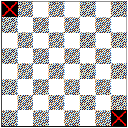

# Jáma lvová  
8.ročník, zadání 2. kola  
## Úloha 2B(Hyperkůň)  
Prokop Parůžek, 3.A, Gymnázium Teplice  
prokop.paruzek (at) paruzkovi.cz  
adresa úlohy: [https://github.com/prokopparuzek/domino_1B](https://github.com/prokopparuzek/domino_1B)    
### zadání  

Medvídek Brumla si v minulém kole (úloha 1B) úspěšně vyrobil flotilu parníků. Nyní by si ze své další šachovnice 8×8 políček chtěl vyrobit
kostičky domina. Problém je, že mu myška Šibalka z šachovnice vyhryzla dva protilehlé rohy (viz obrázek 4). Povede se mu i přesto vyrobit
31 kostiček domina? Ani v tomto případě není přípustné žádné slepování.

  

### řešení  

Brumlovy se kostičky domino složit nepovede.
Aby je mohl složit potřebuje, aby na obě strany byl od každého hryzu sudý počet políček ve stejném směru(svisle nebo vodorovně, stačí jeden směr).
Samozřejmě od obou hryzů stejný směr, ne jeden svisle druhý vodorovně, protože jinak to nefunguje.
Takže třeba kdyby oba hryzy byly v sousedících rozích tak by to šlo.
