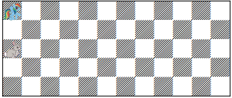

# Jáma lvová  
8.ročník, zadání 2. kola 
## Úloha 2B(Hyperkůň a králíček)   
Prokop Parůžek, 3.A, Gymnázium Teplice  
prokop.paruzek (at) paruzkovi.cz  
adresa úlohy: [https://github.com/prokopparuzek/hyperkunAKralicek_2B](https://github.com/prokopparuzek/hyperkunAKralicek_2B)  
###  zadání    

Už je to pár týdnů, co se hyperkůň vrátil ze šatlavy a kopýtko se mu již zcela zahojilo. Může tak opět skákat, jak je zvyklý – tedy o 2 pole
jedním směrem a 2 pole druhým. S blížícími se Velikonocemi do království Šach zavítala i velikonoční králice Aprikotka. Pro její obveselení
si hyperkůň nachystal malý závod v hopsání. Závodní dráha bude 5 políček široká a 12 políček dlouhá. Hyperkůň bude startovat v první,
nejlevější, dráze, Aprikotka v prostřední, oba dva se před prvním skokem postaví na první políčko dané dráhy. Poskakování Aprikotky
velmi připomíná šachového pěšce, Aprikotka ve svém tahu vždy poposkočí o jedno pole směrem k cíli (na rozdíl od hyperkoně tedy
bude pořád hopsat ve své dráze). Hyperkůň, jakožto vyzyvatel, má první skok, pak skáče Aprikotka, pak zase hyperkůň a tak dále, dokud
někdo z nich neprotrhne cílovou pásku – tedy neskočí kamkoli za dvanácté políčko. Během závodu smí být na každém políčku jen jeden
z nich, jinak by si navzájem ublížili.
Protože je hyperkůň galantní, rozhodl se, že nechá Aprikotku vyhrát. Samozřejmě ale nechce, aby na to přišla, musí to tedy udělat tak,
aby nevzbudil její podezření. Aprikotka má šachografickou paměť a zapamatuje si všechny skoky, které hyperkůň udělá, a začne ho
podezřívat ve chvíli, kdy hyperkůň některý ze svých skoků zopakuje, tj. pokud bude skok začínat i končit na stejných políčkách jako
některý z předchozích. Pokud z jednoho políčka udělá hyperkůň více skoků pokaždé na jiné pole, z různých polí skočí na stejné, případně
prohodí počáteční a koncové políčko skoku, bude vše v pořádku. Pomůžeš hyperkoni naplánovat, jak má skákat, aby Aprikotka vyhrála,
nepojala žádné podezření a zároveň si ani jeden z nich během závodu neublížil?


  


### řešení 

závěr  
Hyperkůň závod jako druhý dokončit dokáže.

pohyb hyperkoně  
Postup hyperkoně budu uvádět v souřadnicích s tím, že levý dolní roh je 0,0(x,y).

```
0)  0,4
1)  2,2
2)  4,4
3)  6,2
4)  8,4
5)  10,2
6)  8,0
7)  6,2
8)  4,0
9)  2,2
10) 0,0
11) 2,2
12) 4,0
13) 6,2
14) 8,0
15) 10,2
16) kamkoli za 11,y 
```
