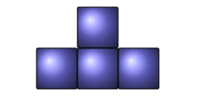

# Jáma lvová
8.ročník, zadání 2. kola

Prokop Parůžek, 3.A, Gymnázium Teplice  
prokop.paruzek (at) paruzkovi.cz  
adresa úlohy: [https://github.com/prokopparuzek/parniky_1B](https://github.com/prokopparuzek/parniky_1B)
## Úloha 1B(Parníky)

### zadání

Méďa Brumla má tuze rád šachy. Bez figurek a šachovnice se ani nehne. Problém je v tom, že nemá s kým hrát, a proto se snaží najít si jinou
zábavu, kde bude moci využít své milované náčiní. Napadlo ho, že by si mohl z figurek vytvořit armádu a ze své klasické šachovnice 8×8
políček vyrobit parníky (viz obrázek 4), aby měl i flotilu.
Povede se Brumlovi vyřezat parníky tak, aniž by mu na šachovnici nějaké políčko zbylo (bez jakéhokoliv slepování)?

### řešení

Brumlovy se parníky vyřezat povede. Jelikož když 4. parníky sestaví do "kruhu" každý otočený o 90°, 
vznikne mu čtverec o straně 4 kostičky a 4 tyto čtverce se mu krásně vejdou do šachovnice 8 * 8.

