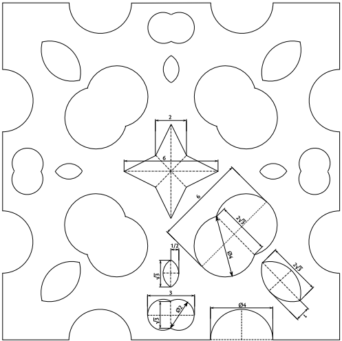

# Jáma lvová
8.ročník, zadání 2. kola

Prokop Parůžek, 3.A, Gymnázium Teplice  
prokop.paruzek (at) paruzkovi.cz  
adresa úlohy: [https://github.com/prokopparuzek/vanoce-z-ementalu_4B](https://github.com/prokopparuzek/vanoce-z-ementalu_4B)

## Úloha 4B(Vánoce z ementálu)

### zadání

Myška Hanka by si o Vánocích chtěla stromeček ozdobit krásnými ementálovými vločkami (viz obrázek 6; rozměry
jsou v cm). Ráda by si jich na stromeček rozvěsila rovných 50, problém je ale v tom, že v obchodě se vločky neprodávají
na kusy, ale na váhu. Hanka ví, že každá vločka má stranu dlouhou 20 cm a tloušťku 2 mm, a také to, že 1 cm3
sýra (bez
ok) má hmotnost 1 g. Kolik gramů ozdob si má Hanka v obchodě poručit?




### řešení

Hvězdici uprostřed si můžeme představit jako čtverec o strane 2 cm a čtyři trojúhelníky o základně 2 cm a výšce 2 cm.
Obsah těchto obrazců spočítáme snadno.

Čtverec
```
S = a * a
S = 2 * 2
S = 4 cm2
```
Trojúhelník
```
S = c * vc / 2
S = 2 * 2 / 2
S = 2 cm2
4S = 8 cm2
```
Dvě spojené kružnice vedle můžeme spojit s půlkruhy hned u nich a máme 2 kružnice o r = 2 / 1 cm.
Zároveň dva půlkruhy na každé straně můžeme spojit v jednu krunžnici o r = 2 cm.

Větší kružnice
```
S = r2 * pi
S = 4 * 3.14
S = 12.7 cm2
12S = 150.8 cm 2
```
Menší kružnice
```
S = r2 * pi
S = 1 * 3.14
S = 3.1 cm2
8S = 25.1 cm 2
```
Nakonec si spočítáme obsah bez ok.
```
S = a2
S = 20 * 20
S = 400 cm2
```
A odečteme součet obsahu ok.
```
S = 400 - 4 - 8 - 150.8 - 25.1
S = 212.1 cm2
```
Výsledek převedeme na mm2 a vynásobíme výškou tím získáme objem.
```
212.1 cm2 = 21210 mm2

V = 21210 * 2
V = 42.4 cm3
```
Vynásobíme 50.
```
V = 42.4 * 50
V = 2120 cm3
```
A z toho vyplívá že Hanka si má poručit 2.12 kg ozdob.
